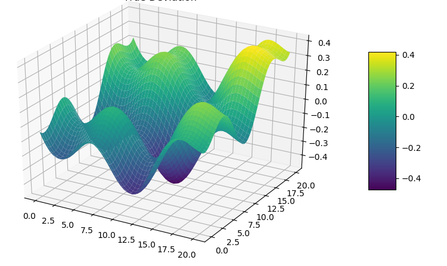

# PROJECT TITLE 

## NON-TECHNICAL EXPLANATION OF YOUR PROJECT
Bayesian Optimisation with Gaussian Process Surrogate Models
A capstone project exploring the use of Bayesian Optimisation (BO) with Gaussian Process (GP) surrogate models and the Upper Confidence Bound (UCB) acquisition function to efficiently locate the global maximum of synthetic black-box functions.

   - Project Description
  Black-box optimisation problems arise frequently in science and engineering — settings where the objective function has no known closed form, is expensive to evaluate, and provides no gradient information. This project applies Bayesian Optimisation as a principled, sample-efficient strategy to tackle this class of problems.

  - Eight synthetic black-box functions of varying complexity are used as benchmarks. For each function, a Gaussian Process surrogate model is constructed and iteratively refined as new observations are collected. The Upper Confidence Bound (UCB) acquisition function guides the search at each step, balancing exploration of uncertain regions against exploitation of promising ones.
  
  - The core research question is: how effectively can a GP surrogate, guided by UCB, recover the global maximum of an unknown function within a fixed evaluation budget?

   - Motivation
  Evaluating a real-world objective function — whether it's a physical experiment, a simulation, or a hyperparameter tuning run — is often costly. Bayesian Optimisation offers a way to find good solutions with far fewer evaluations than grid search or random search by building a probabilistic model of the objective and using that model to decide where to look next.
  This project uses synthetic benchmarks to study the behaviour of the BO loop in a controlled setting, enabling direct comparison between the surrogate model's predictions and the true underlying function.

## Weekly strategy
   Following the initial data provided as descibed in the data_sheet, each student had a maximum of 13 submissions.
   Each week we submitted ONE x input array for each of the 8 synthetic functions to the Capstone Project portal for Imperial Executive Education team to process and email back the results of the correspnding y value. 
   
   The week to week process helped to build our understanding of each black-box function (by building 8 surrogate models) and to suggest the next candidate x values for the next week's submission, with the goal of identifying the global maximum of each function.
 
         Weeks 1-2:  Submissions were largely based on manual reasoning (using scatter plots where feasible) or own insight to pick the next best point to either explore the space of the function in particular where the initial data provided showed a gap in observations in a particular region  
         Weeks 3-6:  Bayesian optimisation using a GP and using UCB (kappa) as the acquisition function was largely used to pick the next best candidate predominately using a higher kappa for exploring the search space or a lower kappa for exploiting
         Weeks 7-10: Where it appeared that the surrogate model was no longer learning or no real imprrovement to the objective function, other parameters controlling the BO intial set up such as N_INI and N_INTER were explored and hypperameters such as the learning rate and n_estimators were tuned accordingly. 

## GitHub structure

.
├── notebooks/          # Jupyter notebooks for each function experiment
├── data_sheet/         # explanation of the data for each function
├── model_card.md       # Model card detailing methodology and results
├── results/            # Saved outputs, plots, and metrics
└── README.md

## DATA
 [data_sheet](https://github.com/ckaur5689/CapstoneProject_MLandAI/blob/main/data_sheet.md)

## MODEL 
 [model_card](https://github.com/ckaur5689/CapstoneProject_MLandAI/blob/main/model_card.md)
 

## KEY CONCEPTS
 
    Gaussian Process — A non-parametric probabilistic model that places a distribution over functions. Given observations, the GP posterior provides a mean prediction and ncertainty estimate at every point in the input space.
  
    Upper Confidence Bound (UCB) — An acquisition function that scores candidate points by their predicted mean plus a scaled uncertainty term. The scaling factor κ\kappa controls how much the search prioritises unexplored regions versus high-predicted-value regions.

    Surrogate Model — An inexpensive-to-evaluate approximation of the true objective function, updated sequentially as new observations are collected.
  
## HYPERPARAMETER OPTIMSATION
        
         Hyperparameter Tuning Strategy
         
         For simpler functions with less dimensions I chose to focus on tunung these two hyperparametets
         
           n_estimators": (50, 400),             # Integer
           learning_rate": (0.01, 0.30),         # Float
    
         and for higher dimensional functions, I explored tuning the first three of the following hyperparameters at most after each weekly iteration
         
           max_depth": (1, 10),                   # Integer
           subsample": (0.5, 1.0),                # Float
           min_samples_leaf": (1, 20),            # Integer
           max_features": (0.0, 1.0),             # Categorical, mapped from float (0.0=sqrt, 1.0=log2)
           min_samples_split": (2, 20),           # Integer
           min_weight_fraction_leaf": (0.0, 0.5)  # Float
         

## RESULTS (To be completed in final write up)
A summary of your results and what you can learn from your model 

You can include images of plots using the code below:

## (OPTIONAL: CONTACT DETAILS)
If you are planning on making your github repo public you may wish to include some contact information such as a link to your twitter or an email address. 

