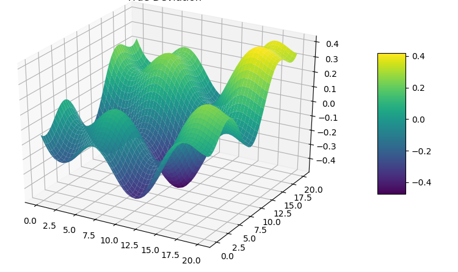

# Capstone Black-Box function Optimisation project

## Bayesian Optimisation with Gaussian Process Surrogate Models

A capstone project exploring the use of Bayesian Optimisation (BO) with Gaussian Process (GP) surrogate models and the Upper Confidence Bound (UCB) acquisition function to efficiently locate the global maximum of synthetic black-box functions.

- Project Description

Black-box optimisation problems arise frequently in science and engineering — settings where the objective function has no known closed form, is expensive to evaluate, and provides no gradient information. This project applies Bayesian Optimisation as a principled, sample-efficient strategy to tackle this class of problems.
Eight synthetic black-box functions of varying complexity are used as benchmarks. For each function, a Gaussian Process surrogate model is constructed and iteratively refined as new observations are collected. The Upper Confidence Bound (UCB) acquisition function guides the search at each step, balancing exploration of uncertain regions against exploitation of promising ones.
The core research question is: how effectively can a GP surrogate, guided by UCB, recover the global maximum of an unknown function within a fixed evaluation budget?

- Motivation

Evaluating a real-world objective function — whether it's a physical experiment, a simulation, or a hyperparameter tuning run — is often costly. Bayesian Optimisation offers a way to find good solutions with far fewer evaluations than grid search or random search by building a probabilistic model of the objective and using that model to decide where to look next.
This project uses synthetic benchmarks to study the behaviour of the BO loop in a controlled setting, enabling direct comparison between the surrogate model's predictions and the true underlying function.

## Weekly strategy

Following the initial data provided as descibed in the data_sheet, each student had a maximum of 13 submissions.
Each week we submitted ONE x input array for each of the 8 synthetic functions to the Capstone Project portal for Imperial Executive Education team to process and email back the results of the correspnding y value.
The week to week process helped to build our understanding of each black-box function (by building 8 surrogate models) and to suggest the next candidate x values for the next week's submission, with the goal of identifying the global maximum of each function.

         Weeks 1-2:  Submissions were largely based on manual reasoning (using scatter plots where feasible) or own insight to pick the next best point to either explore the space of the function in particular where the initial data provided showed a gap in observations in a particular region  
         Weeks 3-6:  Bayesian optimisation using a GP and using UCB (kappa) as the acquisition function was largely used to pick the next best candidate predominately using a higher kappa for exploring the search space or a lower kappa for exploiting
         Weeks 7-10: Where it appeared that the surrogate model was no longer learning or no real imprrovement to the objective function, other parameters controlling the BO intial set up such as N_INI and N_INTER were explored and hypperameters such as the learning rate and n_estimators were tuned accordingly. 
         Weeks 11-13: Continued to tune hyperparamters in weeks 11-12 where needed, and increasingly smaller kappa values with week 13 using the smallest kappa from all rounds.

## BO Strategy Summary

1. Overview of My BBO Approach: The core objective was to maximise the output of eight hidden functions using a Bayesian optimisation framework with a Gaussian Process surrogate model. With a limited query budget across 14 rounds, the challenge was deciding where to search next using only the results of previous queries. My overall strategy followed a deliberate arc — broad exploration in the early rounds to give the surrogate model enough data to learn from, followed by increasingly focused exploitation as patterns emerged and the model became better calibrated.

2. How My Strategy Evolved: The most significant shift was from wide exploration to tight exploitation, with KAPPA reduced progressively across rounds to narrow the search. A second major change came after completing Module 18 on hyperparameter tuning, which prompted more active management of the model's configuration — particularly for higher-dimensional functions where the default setup was causing premature plateaus. Two principles guided every submission throughout: change only one parameter at a time, and use visualisation plots to decide whether further tuning of a given setting was worthwhile.

3. Patterns, Data and Insights: The clearest pattern across all eight functions was the relationship between data volume and result quality — early queries varied widely, while later queries clustered tightly around high-value regions as the model learned. Higher-dimensional functions consistently proved harder, requiring explicit hyperparameter adjustment before progress resumed. The most influential variables were the number of warm-up trials, KAPPA, and the model's learning rate and n_estimators settings — the latter two being closely correlated and best treated as a pair rather than tuned independently.

4. Decision-Making and Iteration: Exploration dominated the early rounds; exploitation took over from around round 11. The one-change-at-a-time rule was the single most useful decision made in this project — it made every round informative regardless of whether results improved. The least effective decision was leaving the hyperparameter configuration unchanged for too long on the higher-dimensional functions, which resulted in avoidable plateaus. When results were unexpected, the first step was always to check whether the model or the search region was the issue, using hyperparameter visualisations to make that call.

6. Next Steps and Reflection: For the final round, the strategy was to submit queries close to the current best-known result for each function using a very small KAPPA, with a small number of queries placed slightly further out to guard against local maxima. The skills developed here — managing uncertainty, balancing exploration and exploitation, and configuring surrogate models — are directly transferable to real-world applications of Bayesian optimisation, including hyperparameter tuning in large ML pipelines, AutoML, and experimental design in fields such as drug discovery. In plain terms: this project was about finding the highest point in an unknown landscape using a limited number of steps, and learning to make each step count.
 

## GitHub structure

        .
         ├── notebooks/          # Jupyter notebooks for each function experiment and results
         
         ├── README.md           # Purpose of this project
         
         ├── data_sheet/         # explanation of the data for each function
   
         ├── image.png           # Model card detailing methodology and results
   
         └── model_card.md       # Model card detailing methodology and results
   
         

## DATA
 [data_sheet](https://github.com/ckaur5689/CapstoneProject_MLandAI/blob/main/data_sheet.md)

## MODEL 
 [model_card](https://github.com/ckaur5689/CapstoneProject_MLandAI/blob/main/model_card.md)
 

## KEY CONCEPTS
 
    Gaussian Process — A non-parametric probabilistic model that places a distribution over functions. Given observations, the GP posterior provides a mean prediction and ncertainty estimate at every point in the input space.
  
    Upper Confidence Bound (UCB) — An acquisition function that scores candidate points by their predicted mean plus a scaled uncertainty term. The scaling factor κ\kappa controls how much the search prioritises unexplored regions versus high-predicted-value regions.

    Surrogate Model — An inexpensive-to-evaluate approximation of the true objective function, updated sequentially as new observations are collected.
  
## HYPERPARAMETER OPTIMSATION
        
         Hyperparameter Tuning Strategy
         
         For simpler functions with less dimensions I chose to focus on tune these hyperparameters but then in week 12 I also added min_samples_leaf to promote learning as the results were not showing an improvement
         
           n_estimators": (50, 400),             # Integer
           learning_rate": (0.01, 0.30),         # Float
           max_depth": (1, 10),                  # Integer
           subsample": (0.5, 1.0),               # Float
    
         and for higher dimensional functions, I explored tuning the first three of the following hyperparameters at most after each weekly iteration and then adding further hyperparameters for improved learning
         
           max_depth": (1, 10),                   # Integer
           subsample": (0.5, 1.0),                # Float
           min_samples_leaf": (1, 20),            # Integer
           max_features": (0.0, 1.0),             # Categorical, mapped from float (0.0=sqrt, 1.0=log2)
           min_samples_split": (2, 20),           # Integer
           min_weight_fraction_leaf": (0.0, 0.5)  # Float
         

## REFLECTIONS and FINAL RESULTS
         
         **Reflections**

         Function 1: Optimisation plateaued early with negligible improvement to the objective function. From week 9, systematic fine-tuning of model parameters and hyperparameters was introduced, which yielded a marked improvement in performance.
         Function 2: RMSE was replaced with negative R² as the objective function from week 7, following a period of stagnation with no measurable gains. I also identified at this stage that the scores returned post-submission represented log-likelihood values — a measure of surrogate model fit — and that the optimisation objective was to maximise rather than minimise this quantity.
         Function 3: Weeks 1–9 were dedicated to broad exploration to establish adequate coverage of the function's space. From week 9, the focus shifted to exploitation, with hyperparameter fine-tuning and search space refinement to drive further performance gains.
         Function 4: Weeks 1–4 prioritised exploration, though limited improvement in the objective function prompted earlier-than-planned hyperparameter experimentation from week 7, which produced notably better results. From week 9, the strategy transitioned to week-on-week exploitation, with iterative tuning of the Bayesian optimisation (BO) parameters and search space adjustments deployed in response to diminishing returns.
         Function 5: An explore-then-exploit strategy was applied, with weeks 1–5 dedicated to exploration and weeks 6–9 transitioning to exploitation. From week 10, the focus shifted exclusively to exploitation, with BO parameter adjustments and search space modifications introduced as needed to sustain progress.
         Function 6: Exploration was maintained through weeks 1–6, with exploitation adopted in week 7. Upon reviewing the results, week 8 saw a deliberate shift back to aggressive exploration (kappa of 1,000) with revised hyperparameter settings to mitigate the risk of convergence to a local optimum. From week 9, the strategy reverted to exploitation for the remainder of the optimisation, with targeted search space adjustments applied whenever diminishing returns were observed.
         Function 7: Weeks 1–6 were allocated to exploration, after which the strategy transitioned to sustained exploitation through to the final submission. Kappa was reduced incrementally from 5.0 in week 7 to 0.1 in week 13 to progressively narrow the search. Concurrently, hyperparameters were added and refined in response to plateaus in the objective function.
         Function 8: Following an initial exploration phase in weeks 1–6, a secondary exploration phase was employed in weeks 7–9 to address a plateau, with BO parameters such as N_ITER tuned directly given that hyperparameter-vs-RMSE diagnostics indicated the ranges of each hyperparameter were appropriate. Weeks 10–13 I returned to exploitation, with kappa reduced steadily from 1.0 to 0.1 across the final submissions.

       **Final Results**
Final results for each function is within the 8 notebooks lcoated here including the proposed location of the global maximum:
         [Notebooks](https://github.com/ckaur5689/CapstoneProject_MLandAI/tree/main/Notebooks)

         

## CONTACT DETAILS
Contact on LinkedIn for more information 

